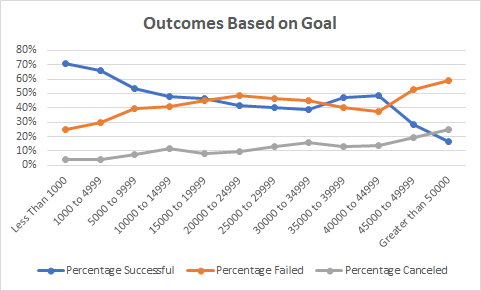

# Module1-Excel

## Overview of Project

Using the kickstarter dataset to visualize campaign outcomes based on their launch dates and their funding goals. 

### Purpose

To inform Louise how many different campaigns fared in relation to their launch dates and their funding goals

## Analysis and Challenges

- Based on our findings we can conclude that there is a higher likelihood to succeed if we launch the campaign in May with a goal of $9,999 or less. Once we increase our goal or wander passed May we find challenge in creating a higher liklihood to fail rather than succeed. 

### Analysis of Outcomes Based on Launch Date

- 

- We are more likely to succeed if we plan our launch date to be in May than if we palnned it to be in any other month of the year. 

### Analysis of Outcomes Based on Goals

- 

- Based on the Goals, the outcome we can conclude is that we have more liklihood of success if we plan our goal to be lower than $9,999. 

- If we set our goal to be $19,999, we are more likely to fail rather than succeed based on our data collected. 

### Challenges and Difficulties Encountered

- I had some confusion with the COUNTIFS function, however I belive I was able to work it out. I noticed that for this dataset regardless of the order of criteria ranges, whether it began with the goal criteria or number outcome criteria the result was the same. 

## Results

- Two conclusion that can be drawn about the outcomes based on Launch Date are that there were 525 successful theater kickstarters in the U.S. and that May was the month with the most succesfully launched campaigns.

- From looking at the outcomes based on Goals I can conclude that goals $9,999 and below have a 50% more likliehood of succeeding than goals $10,000 and greater. 

- The limitation of this dataset is the range of goals has quite a jump from the beginning of $1000 to than $3999 and then $4999 till we get to $50000. This could skew the data results since the range is not evenly distributed.  

- One other possibility for a chart we could use would be a bar chart utilizing data between "plays" and "musicals" only to compare on a more granualar level to find which type is more likely to succeed. 

- Another possibilitiy would be to create a line chart of the average donations percentage based on the total goal and anayze the outcomes. This way we may be able to provide Louise with insights on her approach when requesting donations. 
